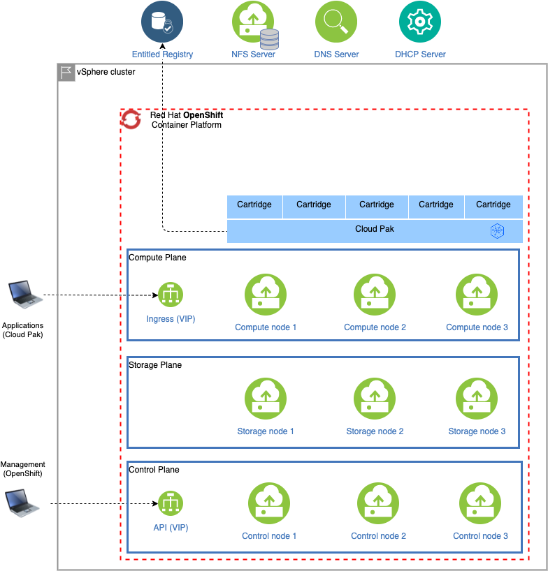

# OpenShift on vSphere with NFS and OCS storage classes and Cloud Pak for Data
This is a sample configuration for OpenShift on vSphere (VMWare) with NFS and OCS storage and using the entitled registry. Only the OpenShift cluster and Cloud Pak for Data are managed by the deployer and deployment requires a vSphere admin user and password, the OpenShift pull secret and a Cloud Pak entitlement key. 

## Infrastructure

### vSphere cluster
The vSphere cluster onto which the OpenShift cluster is provisioned using the IPI (Installer Provisioned Infrastructure) installer.

### NFS Server
An optionally existing NFS server that will be used to create the `managed-nfs-storage` storage class in OpenShift.

## OpenShift
An OpenShift cluster with the specified version (4.8) is provisioned inside the specified VM folder. In the sample configuration, the `managed-nfs-storage` storage class is created, referencing the specified NFS server. Additionally 3 additional nodes are created using an OpenShift MachineSet and which will run the OpenShift Container Storge. For back-end storage for the OCS cluster, the `thin` storage class is used.

## Cloud Pak for Data
Cloud Pak for Data 4.0 is installed in OpenShift project `zen-40`, pulling images from the entitled registry and referencing the NFS storage class in OpenShift.

### Cartridges
The sample configuration holds a list of cartridges which will be installed. You can control whether cartridges will be installed by commenting or uncommenting the appropriate blocks. Please ensure that the cartridge elements are aligned (hyphens must be aligned with hyphens and properties with properties).

By default, the following cartridges will be installed:
* Cloud Pak Foundational Services (is installed as part of the Cloud Pak for Data control plane)
* Cloud Pak for Data control plane (mandatory)
* Watson Studio
* Watson Machine Learning